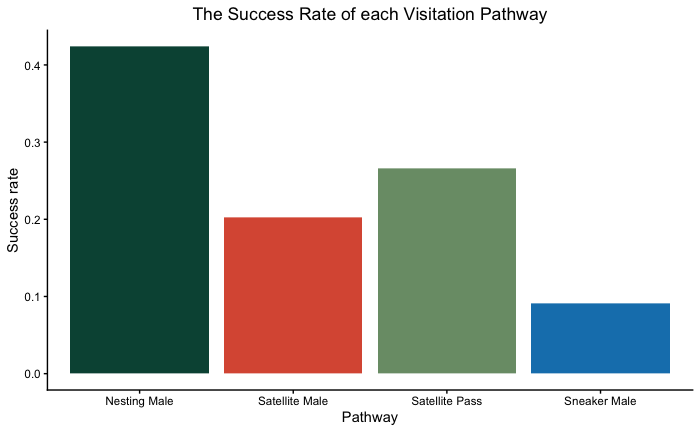
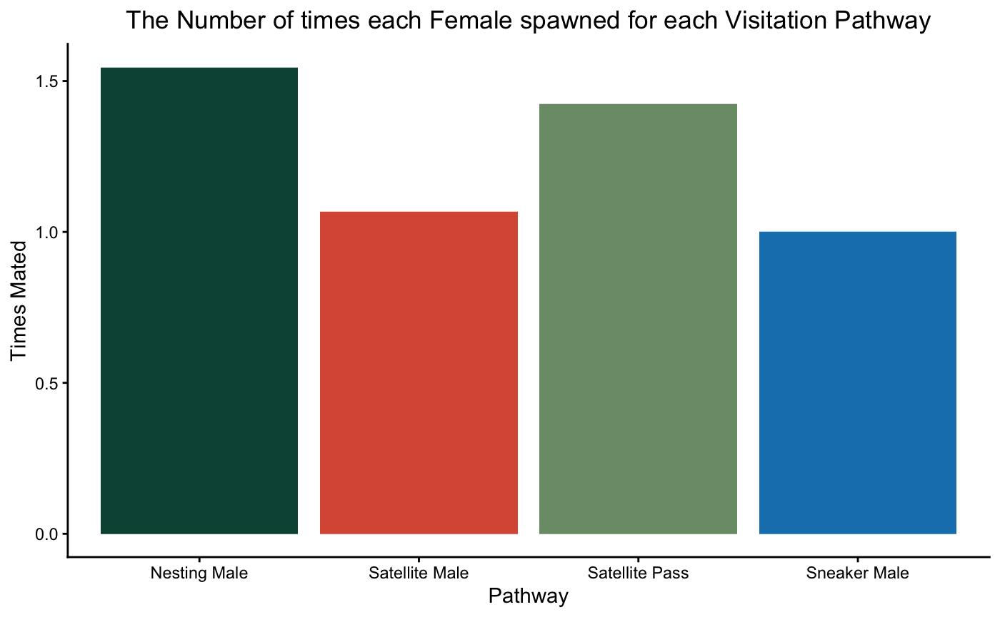

# Context

The goal of this quarto document is to delve deeper into the female visitation "pathways" previously explored in other documents. We are interested in these graphs specifically:\
\
\

\
The code for these graphs is located in Data_Analysis_Code.qmd. These graphs are interesting because not much research has been done on understanding female mate choice, especially in the wrasse. Thus these graphs give us potential insight into the complexity (possibly) of female decision making.

## Code Wrangling

Lets bring the code in.

```{r}
#Install and library important packages
#install.packages('ggplot2')
#install.packages('ggeffects')
#install.packages('RColorBrewer')
#install.packages('here')
#install.packages('MASS')
#install.packages('tidyverse')
#install.packages('janitor')
#install.packages('readxl')
#install.packages('brms')
#install.packages('ProbBayes')
library(ProbBayes)
library(ggeffects)
library(tidyverse)
library(janitor)
library(here)
library(ggplot2)
library(readxl)
library(dplyr)
library(brms)
library(RColorBrewer)
library(tibble)
library(MASS)

behavior_sheet <- read_excel("UW_Nest_Behavioral_Sheets_Cleaned.xlsx")

behavior_sheet_date <- as.Date(behavior_sheet$Date)
behavior_sheet$Date <- behavior_sheet_date
behavior_sheet_sep <- behavior_sheet %>%
  mutate(Year = year(Date)) %>%
  mutate(Month = month(Date)) %>%
  mutate(Day = day(Date)) %>%
  relocate(Year, .after = Date) %>%
  relocate(Month, .after = Year) %>%
  relocate(Day, .after = Month)
head(behavior_sheet_sep)

#Fix SAT submission to NM from chr to num
sat_sub <- as.numeric(behavior_sheet_sep$`SAT submission to NM`) #Creates a vector with the same entries but as numbers
behavior_sheet_sep$`SAT submission to NM` <- sat_sub #put it back into the tibble
#Do the same for SNK Submission to SAT
snk_sub <- as.numeric(behavior_sheet_sep$`SNK submission to SAT`)
behavior_sheet_sep$`SNK submission to SAT` <- snk_sub
#Same for NM aggression to SAT
NM_aggsat <- as.numeric(behavior_sheet_sep$`NM aggression to SAT`)
behavior_sheet_sep$`NM aggression to SAT` <- NM_aggsat

behavior_sheet_cln <- behavior_sheet_sep |>
  #Uses the Janitor package to standardize the names
  clean_names()

#Turn the year variable into a character for ease of comparison later on
year_date <- as.character(behavior_sheet_cln$year) #Creates a vector with years as chr
behavior_sheet_cln$year <- year_date #creates a new variable for ease of graphing later on
```

Let's now start running some significant differences tests.
